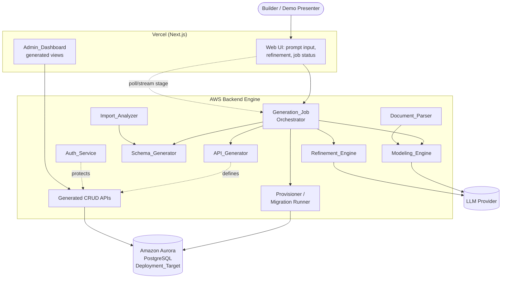
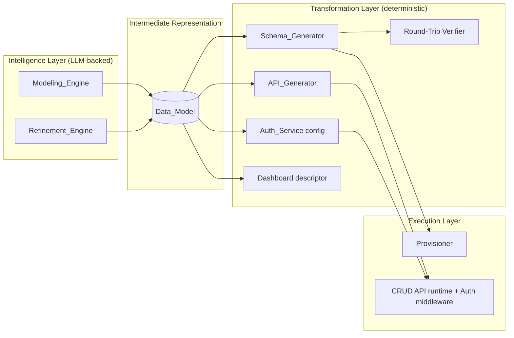
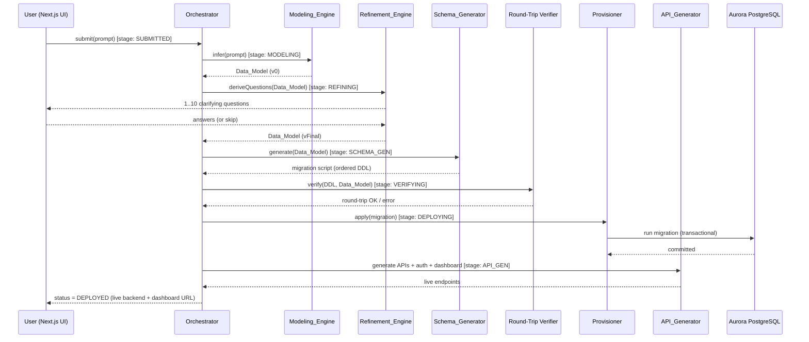
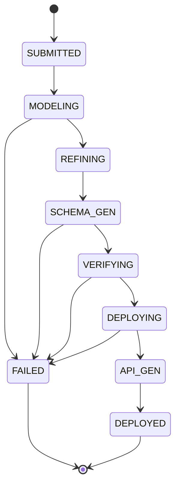

# Design Document

## Overview

The AI Database Architect converts a natural-language domain description (or, secondarily, an uploaded document) into a live relational backend on AWS. The product's differentiator is **intelligent data modeling**: inferring entities, attributes, relationships, normalization, and constraints before any code is generated. Everything downstream — DDL, CRUD APIs, authentication, and the admin dashboard — is a comparatively mechanical projection of a single, well-formed intermediate representation called the **Data_Model**.

This design is organized around the hackathon priority tags from the requirements document:

- **[MUST] — primary demo path.** The vertical slice the architecture is centered on: *prompt → Data_Model → refinement → Aurora PostgreSQL schema → live deploy → CRUD APIs + role-based auth + admin dashboard*, completing in ~30 seconds. Covers Requirements 1, 2, 3, 4, 5, 6, 7, 8, 9, 12.
- **[SECONDARY] — built if time allows.** Document-to-backend ingestion (Requirement 10) via the Document_Parser.
- **[STRETCH] — aspirational, may be stubbed.** Existing-database import (Requirement 11) and alternative targets Aurora DSQL / DynamoDB (Requirement 13).

The central design decision is to make the **Data_Model a dialect-independent IR** that sits between the LLM-powered inference layer and every code generator. This keeps the LLM's job bounded (produce a structured model, not raw SQL), makes generation deterministic and testable, and isolates the one place where intelligence lives (the Modeling_Engine and Refinement_Engine) from the many places where mechanical transformation happens.

### Design Principles

1. **Model first, generate second.** The LLM never writes DDL, API code, or SQL directly. It emits a structured Data_Model that is validated against a schema before any generator runs. This bounds LLM error and makes the pipeline deterministic from the IR onward.
2. **One IR, many projections.** Schema_Generator, API_Generator, Auth_Service, and Admin_Dashboard are all pure(ish) functions of the Data_Model. Adding a target (DSQL, DynamoDB) means adding a projection, not changing the core.
3. **Verify the round trip.** Before deploying, the generated DDL is parsed back into a Data_Model and compared to the source (Requirement 12). If anything was added, lost, or altered, the job fails closed rather than deploying a lossy schema.
4. **Fail closed, never partial.** Every generation and deployment step is all-or-nothing. No partial migration scripts, no partially deployed schemas, no orphaned artifacts after a timeout (Requirements 3.10, 4.4, 9.4).
5. **Stage-driven orchestration.** A Generation_Job is a small state machine whose stage is always observable to the UI within 2 seconds (Requirement 9.2) and bounded by hard timeouts (Requirements 9.1, 9.3).

## Architecture

### System Context



### Layered View

The system separates **intelligence** (LLM-backed inference) from **transformation** (deterministic generation) from **execution** (provisioning and serving).



### End-to-End Generation Flow (the [MUST] slice)



### Generation_Job State Machine

The Generation_Job is the orchestration backbone. Its stage is the unit of progress reporting (Requirement 9.2) and the anchor for timeout handling (Requirements 9.1, 9.3, 9.4).



- The orchestrator enforces an overall soft target of 30s (Requirement 9.1) and a hard ceiling of 60s (Requirement 9.3). On breach it transitions to `FAILED` with the **active stage name** in the timeout report, and triggers compensation to discard partial artifacts (Requirement 9.4).
- Each stage transition publishes the new stage to the UI; the UI reflects it within 2s (Requirement 9.2). Implemented via server-sent events / polling of the job's `currentStage`.
- If the accepted Data_Model has > 10 entities, the orchestrator surfaces a "30s not guaranteed" notice before starting (Requirement 9.5).

### Technology Stack

| Concern | Choice | Rationale |
|---|---|---|
| Frontend | Next.js on Vercel (scaffolded via v0) | Hackathon brief; fast UI iteration, easy deploy. |
| Backend engine | Node/TypeScript service(s) on AWS | Shared types with the Data_Model IR; one language across IR, generators, and generated API runtime. |
| LLM | Hosted LLM provider, called only by Modeling_Engine & Refinement_Engine | Bounded, structured-output usage. |
| Primary DB target | Amazon Aurora PostgreSQL | Requirement 3, 4; primary demo target. |
| Stretch targets | Aurora DSQL, DynamoDB | Requirement 13; projection plug-ins. |
| DDL parsing (round trip) | PostgreSQL grammar parser (e.g., `pgsql-ast-parser`) | Requirement 12 needs DDL → Data_Model. |
| Migration execution | Single transactional script via PostgreSQL driver | Requirement 4 atomic apply + rollback. |

## Components and Interfaces

All components communicate through the **Data_Model** IR (see Data Models) and small typed request/response contracts. Interfaces below are expressed as TypeScript signatures; concrete types are defined in the Data Models section.

### Modeling_Engine

The core differentiator. Turns unstructured input into a structured, validated Data_Model. The LLM is prompted to emit a structured model (constrained JSON), which is then validated, normalized, and constraint-enriched by deterministic post-processing so the LLM's output is never trusted blindly.

```typescript
interface ModelingEngine {
  // Requirement 1: prompt -> Data_Model
  inferFromPrompt(prompt: string): Promise<Result<DataModel, ModelingError>>;
  // Requirement 10.2/10.3: document records -> Data_Model (SECONDARY)
  inferFromRecords(records: ExtractedRecord[]): Promise<Result<DataModel, ModelingError>>;
}
```

Responsibilities:
- Validate input length and emptiness before calling the LLM (Requirements 1.6, 1.7).
- Prompt the LLM to produce entities, attributes, relationships (Requirement 1.1).
- Deterministic post-processing guarantees the structural invariants the LLM might miss:
  - Assign exactly one primary key per entity; synthesize a surrogate `id` key if none inferred (Requirements 1.2, 2.6).
  - Normalize every relationship cardinality to one of `ONE_TO_ONE | ONE_TO_MANY | MANY_TO_MANY` (Requirement 1.3).
  - Assign exactly one supported data type per attribute (Requirement 1.4).
  - Materialize a join entity for each many-to-many relationship, referencing both PKs (Requirement 1.5).
- Constraint inference (Requirement 2): mark unique/not-null, attach email-format and numeric-range constraints, define foreign keys for relationships, and flag low-confidence attributes for builder review (Requirement 2.7).
- Fail closed if no entity can be inferred (Requirement 1.8).
- For documents, detect repeating field groups to split into separate entities rather than one flat table (Requirement 10.2).

### Refinement_Engine

Generates clarifying questions and folds the user's answers back into the Data_Model without losing prior structure.

```typescript
interface RefinementEngine {
  deriveQuestions(model: DataModel): ClarifyingQuestion[]; // 0..10, Req 8.1/8.2
  applyAnswers(
    model: DataModel,
    answers: Answer[]
  ): Result<DataModel, RefinementConflict>; // Req 8.3/8.4/8.5
}
```

Responsibilities:
- Derive between 1 and 10 questions, each traceable to an entity/attribute/relationship in the current model (Requirement 8.1).
- If nothing can ground a question, return zero questions and proceed (Requirement 8.2, 8.6).
- Apply selected answers: update the model, **retaining all prior elements not contradicted** by the answers (Requirement 8.3); add entities/attributes/relationships for opt-in features (Requirement 8.4).
- Reject a conflicting answer, leave the model unchanged, and identify the conflicting element (Requirement 8.5).

### Schema_Generator

Deterministic projection of a Data_Model into an ordered Aurora PostgreSQL migration script. This is the most heavily property-tested component.

```typescript
interface SchemaGenerator {
  generate(
    model: DataModel,
    target: DeploymentTargetKind // default POSTGRES
  ): Result<MigrationScript, SchemaGenError>;
}
```

Responsibilities:
- One `CREATE TABLE` per entity (Requirements 3.1, 12.1).
- Emit every column with its mapped type, plus primary key (composite PKs as one constraint) (Requirement 3.2).
- Emit foreign-key constraints for relationships (Requirement 3.3) and unique/not-null column constraints (Requirement 3.4).
- Exactly one index per foreign-key column (Requirement 3.5).
- Topologically order statements so referenced tables precede referencing tables (Requirement 3.6).
- Error, emitting no DDL, on: relationship to an undefined entity (3.7), unmappable data type (3.8), cyclic dependency with no valid ordering (3.9). Never emit a partial script (3.10).
- For stretch targets, delegate to a `TargetProjection` (Requirement 13).

### Round-Trip Verifier

Guards Requirement 12. Parses the generated DDL back into a Data_Model and structurally compares it to the source.

```typescript
interface RoundTripVerifier {
  verify(
    ddl: MigrationScript,
    source: DataModel
  ): Result<void, RoundTripDiff>; // Req 12.2/12.3/12.4/12.5
  parseDDL(ddl: MigrationScript): DataModel; // DDL -> IR
}
```

Responsibilities:
- Parse DDL into entities, relationships, and constraints.
- Compare entity sets (name + attribute names + attribute types), relationship sets (source, target, cardinality), and constraint sets (PK, FK, unique, nullability).
- On any added/lost/altered element, reject the DDL and report the specific diff, leaving the source Data_Model unchanged (Requirement 12.5). This is the deploy gate: VERIFYING must pass before DEPLOYING.

### Provisioner / Migration Runner

Applies the verified migration to the live Aurora PostgreSQL target atomically.

```typescript
interface Provisioner {
  apply(
    script: MigrationScript,
    target: DeploymentTarget
  ): Promise<DeployResult>; // Req 4
}
```

Responsibilities:
- Connect within 30s or fail with a connectivity error (Requirement 4.5).
- Apply the whole script inside a single transaction; commit only if every statement succeeds → status `deployed` (Requirement 4.2), within the 300s apply ceiling (Requirement 4.1).
- On any failure, roll back so the target is restored to its pre-migration state and record `failed` with a reason (Requirements 4.3, 4.4).

### API_Generator + Generated CRUD Runtime

Projects the Data_Model into CRUD REST endpoints and the runtime that serves them.

```typescript
interface ApiGenerator {
  generate(model: DataModel): ApiSurface; // Req 5.1
}
// Runtime contract per entity
interface EntityApi {
  create(payload): Result<Record, ValidationError>;   // Req 5.2, 5.6
  read(pk): Result<Record, NotFoundError>;             // Req 5.3, 5.7
  update(pk, payload): Result<Record, ValidationError | NotFoundError>; // Req 5.4
  delete(pk): Result<DeleteConfirmation, NotFoundError>; // Req 5.5, 5.7
  list(page?: PageRequest): Result<Page<Record>, ValidationError>; // Req 5.8, 5.9
}
```

Responsibilities:
- Generate create/read/update/delete/list endpoints per entity (Requirement 5.1).
- Validate payloads against Data_Model constraints; reject with per-constraint errors and zero persistence on violation (Requirement 5.6).
- Return the created/updated record (with assigned PK) on success (Requirements 5.2, 5.4); not-found on missing PK (Requirement 5.7).
- Default list page size 25, ordered by PK ascending (Requirement 5.8); reject page size outside [1,100] (Requirement 5.9).

### Auth_Service

Generated authentication and role-based authorization, applied to every protected endpoint.

```typescript
interface AuthService {
  signup(identifier: string, password: string): Result<UserAccount, AuthError>; // Req 6.1,6.7,6.8
  login(identifier: string, password: string): Result<Jwt, AuthError>;          // Req 6.2,6.3
  authorize(token: string | null, requiredRole?: Role): Result<AuthContext, AuthError>; // Req 6.4,6.5
}
```

Responsibilities:
- Store passwords as one-way hashes, never plaintext (Requirement 6.1).
- Reject signup missing credentials (6.7) or with a duplicate identifier (6.8).
- Issue JWTs expiring ≤ 24h after issuance (Requirement 6.2); reject invalid credentials without issuing a token (6.3).
- Reject missing/malformed/expired tokens (6.4) and insufficient-role requests (6.5) without executing the operation.
- Provide at least two roles (e.g., `admin`, `viewer`) differing by at least one permission (Requirement 6.6).

### Admin_Dashboard

Generated Next.js views (descriptor-driven) that call the generated CRUD APIs.

```typescript
interface DashboardDescriptor {
  entities: EntityView[]; // navigable list, Req 7.1
}
interface EntityView {
  columns: ColumnView[];
  pageSize: number; // <= 100, Req 7.2/7.6
  searchableAttributes: string[];
  filterableAttributes: string[];
}
```

Responsibilities:
- List generated entities; show records with bounded page size ≤ 100 (Requirements 7.1, 7.2).
- Wire create/edit/delete actions to the generated APIs and reflect the updated state on success (Requirements 7.3, 7.4).
- On action failure, leave displayed records unchanged and show an error (Requirement 7.5).
- Search returns only records whose attribute values contain the term (bounded page) (Requirement 7.6); filters return only matching records (7.7); empty matches show an empty-result indication (7.8).

### Document_Parser [SECONDARY]

```typescript
interface DocumentParser {
  parse(file: UploadedFile): Result<ExtractedRecord[], ParseError>; // Req 10
}
```

Responsibilities:
- Accept CSV/Excel/PDF up to 50 MB; extract named-field records within 30s (Requirement 10.1).
- Reject unsupported formats (10.4), unparseable files (10.5), empty extractions (10.6), and oversize files (10.7), retaining no records on error.

### Import_Analyzer [STRETCH]

```typescript
interface ImportAnalyzer {
  importSchema(conn: DbCredentials): Result<DataModel, ImportError>;      // Req 11.1,11.2,11.5
  suggest(model: DataModel): ImprovementSuggestion[];                     // Req 11.3
}
```

Responsibilities:
- Connect within 30s and extract tables/columns/types/PKs/FKs/indexes into a Data_Model (Requirement 11.1).
- Record unsupported elements with a not-extracted indicator and continue (Requirement 11.2).
- Produce normalization (up to 3NF), missing-PK, and missing-FK suggestions (Requirement 11.3); apply accepted, exclude rejected (11.4).
- Distinguish connection-timeout vs authentication failure on error, leaving any existing model unchanged (Requirement 11.5).

### Generation_Job Orchestrator

Owns the state machine, timeouts, stage publishing, and compensation.

```typescript
interface Orchestrator {
  run(input: JobInput): Promise<GenerationJob>;
  currentStage(jobId: string): GenerationStage; // for UI polling/stream
}
```

Responsibilities:
- Drive SUBMITTED → … → DEPLOYED, publishing each stage (Requirement 9.2).
- Enforce 30s target and 60s hard timeout; on timeout, fail with the active stage and discard partial artifacts (Requirements 9.1, 9.3, 9.4).
- Warn when > 10 entities (Requirement 9.5).

## Data Models

### The Data_Model Intermediate Representation

The Data_Model is the dialect-independent contract between intelligence and transformation. It is the single source of truth that every generator consumes and that the round-trip verifier reconstructs.

```typescript
type DataModel = {
  entities: Entity[];
  relationships: Relationship[];
};

type Entity = {
  name: string;                 // unique within the model
  attributes: Attribute[];
  primaryKey: string[];         // exactly one PK; >1 element = composite (Req 1.2, 3.2)
  isJoinEntity: boolean;        // true for synthesized M:N join tables (Req 1.5)
  needsReview?: boolean;        // low-confidence flag (Req 2.7)
};

type Attribute = {
  name: string;                 // unique within its entity
  dataType: DataType;           // exactly one supported type (Req 1.4)
  constraints: AttributeConstraint[];
  needsReview?: boolean;        // Req 2.7
};

type DataType =
  | 'UUID' | 'TEXT' | 'VARCHAR' | 'INTEGER' | 'BIGINT'
  | 'NUMERIC' | 'BOOLEAN' | 'DATE' | 'TIMESTAMP' | 'JSON';

type AttributeConstraint =
  | { kind: 'PRIMARY_KEY' }
  | { kind: 'UNIQUE' }                                   // Req 2.1
  | { kind: 'NOT_NULL' }                                 // Req 2.2
  | { kind: 'FORMAT'; format: 'EMAIL' }                  // Req 2.3
  | { kind: 'RANGE'; min?: number; max?: number }        // Req 2.4
  | { kind: 'FOREIGN_KEY'; references: { entity: string; attribute: string } }; // Req 2.5

type Relationship = {
  source: string;               // entity name
  target: string;               // entity name
  cardinality: 'ONE_TO_ONE' | 'ONE_TO_MANY' | 'MANY_TO_MANY'; // Req 1.3
  // For MANY_TO_MANY, the Modeling_Engine also emits a join Entity (Req 1.5)
};
```

#### Data_Model Invariants (enforced by Modeling_Engine / Refinement_Engine)

These invariants must hold for any Data_Model handed to the Schema_Generator. They are the basis for several correctness properties.

- **I1 — Single PK per entity:** every `Entity.primaryKey` is non-empty (Requirement 1.2). A surrogate key is synthesized when none is inferred (Requirement 2.6).
- **I2 — Typed attributes:** every `Attribute.dataType` is a member of `DataType` (Requirement 1.4).
- **I3 — Valid cardinality:** every `Relationship.cardinality` is one of the three allowed values (Requirement 1.3).
- **I4 — M:N join entities:** for every `MANY_TO_MANY` relationship there exists a join entity with foreign keys to both endpoints' primary keys (Requirement 1.5).
- **I5 — FK targets exist:** every `FOREIGN_KEY.references.entity` names an entity in the model (Requirements 2.5, 2.6).
- **I6 — Referential closure for relationships:** every `Relationship.source`/`target` names a defined entity (precondition checked by Schema_Generator → Requirement 3.7).

### Generation_Job

```typescript
type GenerationStage =
  | 'SUBMITTED' | 'MODELING' | 'REFINING' | 'SCHEMA_GEN'
  | 'VERIFYING' | 'DEPLOYING' | 'API_GEN' | 'DEPLOYED' | 'FAILED';

type GenerationJob = {
  id: string;
  input: JobInput;
  model?: DataModel;
  migration?: MigrationScript;
  currentStage: GenerationStage;
  status: 'submitted' | 'running' | 'deployed' | 'failed';
  startedAt: number;
  failure?: { stage: GenerationStage; reason: string };
};
```

### MigrationScript and Deployment

```typescript
type MigrationScript = {
  target: DeploymentTargetKind;            // 'POSTGRES' | 'AURORA_DSQL' | 'DYNAMODB'
  statements: DdlStatement[];              // ordered (Req 3.6)
};

type DdlStatement = { sql: string; kind: 'CREATE_TABLE' | 'ADD_FK' | 'CREATE_INDEX' };

type DeploymentTarget = {
  kind: DeploymentTargetKind;
  connection: DbCredentials;
};

type DeployResult =
  | { status: 'deployed' }
  | { status: 'failed'; reason: string; cause: 'CONNECTIVITY' | 'MIGRATION' };
```

### DataType → Aurora PostgreSQL mapping

The Schema_Generator uses a fixed mapping table. An attribute whose `dataType` is not in this table triggers Requirement 3.8.

| Data_Model `DataType` | PostgreSQL type |
|---|---|
| `UUID` | `uuid` |
| `TEXT` | `text` |
| `VARCHAR` | `varchar(255)` |
| `INTEGER` | `integer` |
| `BIGINT` | `bigint` |
| `NUMERIC` | `numeric` |
| `BOOLEAN` | `boolean` |
| `DATE` | `date` |
| `TIMESTAMP` | `timestamptz` |
| `JSON` | `jsonb` |

## Correctness Properties

*A property is a characteristic or behavior that should hold true across all valid executions of a system — essentially, a formal statement about what the system should do. Properties serve as the bridge between human-readable specifications and machine-verifiable correctness guarantees.*

PBT applies strongly to this feature because the core components are deterministic transformations over a large structured input space: the Modeling_Engine's post-processing (raw model → validated Data_Model), the Schema_Generator (Data_Model → DDL), the Round-Trip Verifier (DDL → Data_Model), the generated CRUD/validation logic, and the Auth_Service. The LLM call itself is non-deterministic and is stubbed in property tests so the deterministic logic around it can be exercised across many generated inputs. Live-AWS timing, provisioning, and external-service behavior (Requirements 4.1–4.3, 4.5, 4.6, 9.1, 11.1, 11.5) are covered by integration and smoke tests, not properties.

The properties below are the consolidated set after redundancy elimination (e.g., model→DDL faithfulness for columns/types/PK/FK/unique/nullability is captured once by the round-trip properties P_RT_* rather than per criterion).

**Core Modeling Properties**

### Property 1: Modeling produces well-formed structure

*For any* non-empty, within-length domain prompt (with the LLM inference layer stubbed to return arbitrary raw candidate models), the Data_Model produced by the Modeling_Engine contains at least one entity, and every entity has at least one attribute and recorded relationships are present in the model.

**Validates: Requirements 1.1**

### Property 2: Exactly one primary key per entity

*For any* Data_Model produced by the Modeling_Engine (including raw candidates with missing or multiple primary keys), every entity has exactly one primary key (a single `primaryKey` list that is non-empty), with a surrogate key synthesized when none was inferred and any FK-target entity guaranteed to have one.

**Validates: Requirements 1.2, 2.6**

### Property 3: Relationship cardinality is always valid

*For any* Data_Model produced by the Modeling_Engine, every relationship's cardinality is exactly one of `ONE_TO_ONE`, `ONE_TO_MANY`, or `MANY_TO_MANY`.

**Validates: Requirements 1.3**

### Property 4: Every attribute has exactly one supported data type

*For any* Data_Model produced by the Modeling_Engine, every attribute is assigned exactly one data type drawn from the supported `DataType` set.

**Validates: Requirements 1.4**

### Property 5: Many-to-many relationships materialize a join entity

*For any* Data_Model containing a many-to-many relationship between two entities, there exists a join entity whose foreign keys reference the primary key of each of the two related entities.

**Validates: Requirements 1.5**

### Property 6: Empty or whitespace input is rejected

*For any* string composed entirely of whitespace (including the empty string), submitting it as a domain description yields a validation error stating a non-empty description is required and produces no Data_Model.

**Validates: Requirements 1.6**

**Constraint Inference Properties**

### Property 7: Email format constraint accepts exactly the well-formed emails

*For any* string, the inferred email-format constraint accepts the string if and only if it contains exactly one `@` separating a non-empty local part from a domain part that contains at least one `.`, and rejects every other string.

**Validates: Requirements 2.3**

### Property 8: Numeric range constraint inference and enforcement

*For any* numeric attribute named with a natural-lower-bound concept (count, quantity, age, price), the Modeling_Engine attaches a range constraint with minimum 0; and *for any* value below a range constraint's minimum, the constraint rejects that value.

**Validates: Requirements 2.4**

### Property 9: Relationships produce foreign-key constraints to the target primary key

*For any* Data_Model relationship between two defined entities, the dependent entity carries a foreign-key constraint referencing the related entity's primary-key attribute, and this foreign key appears in the generated DDL.

**Validates: Requirements 2.5, 3.3**

**Schema Generation Properties**

### Property 10: Exactly one index per foreign-key column

*For any* Data_Model, the generated DDL contains exactly one index per foreign-key column (the count of foreign-key indexes equals the count of foreign-key columns).

**Validates: Requirements 3.5**

### Property 11: Migration script is topologically ordered

*For any* acyclic Data_Model, in the emitted migration script every referenced table's `CREATE TABLE` statement appears before the `CREATE TABLE` statement of any table that references it.

**Validates: Requirements 3.6**

### Property 12: Dangling relationship targets are rejected

*For any* Data_Model containing a relationship whose source or target names an entity not defined in the model, schema generation returns an error identifying the undefined entity and emits no DDL.

**Validates: Requirements 3.7**

### Property 13: Unorderable cyclic dependencies are rejected

*For any* Data_Model whose foreign-key dependency graph contains a cycle that admits no ordering placing every referenced table before its referencing table, schema generation returns an error identifying the entities in the cycle and emits no migration script.

**Validates: Requirements 3.9**

### Property 14: Errors leave no partial output (fail closed)

*For any* Data_Model that triggers any schema-generation error condition, the generator emits no DDL whatsoever (no partial migration script and no leftover output).

**Validates: Requirements 3.10**

**Round-Trip Integrity Properties**

### Property 15: Round-trip preserves entities

*For any* valid Data_Model, parsing the generated DDL back into entities yields a set equal to the source model's entities, where equality requires matching entity name, identical attribute names, and identical attribute data types.

**Validates: Requirements 12.2, 12.1**

### Property 16: Round-trip preserves relationships

*For any* valid Data_Model, parsing the generated DDL back into relationships yields a set equal to the source model's relationships, where equality requires matching source entity, target entity, and cardinality.

**Validates: Requirements 12.3**

### Property 17: Round-trip preserves constraints

*For any* valid Data_Model, parsing the generated DDL back into constraints yields a set equal to the source model's constraints across primary-key, foreign-key, unique, and nullability constraints; and the count of generated tables equals the count of source entities.

**Validates: Requirements 12.1, 12.4, 3.1, 3.2, 3.4, 2.1, 2.2**

### Property 18: Round-trip mismatch fails closed

*For any* mutation of the generated DDL that adds, loses, or alters an entity, relationship, or constraint relative to the source model, the round-trip verifier rejects the DDL, reports the specific differing element, and leaves the source Data_Model unchanged.

**Validates: Requirements 12.5**

**Deployment Integrity**

### Property 19: Failed migration rolls back completely

*For any* migration script that fails at some statement (tested against a transactional store/fake and corroborated by integration tests), the resulting schema state equals the schema state prior to the migration attempt (no partial schema change remains).

**Validates: Requirements 4.4**

**Generated CRUD API Properties**

### Property 20: CRUD surface is complete for every entity

*For any* deployed Data_Model, the generated API surface exposes create, read, update, delete, and list operations for every entity in the model.

**Validates: Requirements 5.1**

### Property 21: Create/read/update round-trip preserves records

*For any* entity record that satisfies all model constraints, creating it returns the record with an assigned primary key, reading by that primary key returns an equal record, and updating it with a valid payload then reading returns the updated record.

**Validates: Requirements 5.2, 5.3, 5.4**

### Property 22: Delete removes the record

*For any* persisted record, deleting it by primary key returns a deletion confirmation and a subsequent read by that primary key returns a not-found error.

**Validates: Requirements 5.5**

### Property 23: Constraint-violating payloads are rejected without persistence

*For any* request payload that violates one or more model constraints, the generated API rejects the request, persists no change, and returns a validation error identifying each violated constraint.

**Validates: Requirements 5.6**

### Property 24: Operations on absent primary keys are not-found and inert

*For any* store and any primary key absent from it, a read, update, or delete request returns a not-found error and leaves stored data unchanged.

**Validates: Requirements 5.7**

### Property 25: Default list pagination

*For any* store, a list request with no page size returns at most 25 records ordered by primary key ascending, equal to the first 25 records of the primary-key-ascending ordering.

**Validates: Requirements 5.8**

### Property 26: List/display page size bounds

*For any* requested page size, a list request is rejected with a validation error if and only if the size is less than 1 or greater than 100; and every generated dashboard entity view uses a page size not exceeding 100.

**Validates: Requirements 5.9, 7.2**

**Authentication and Authorization Properties**

### Property 27: Passwords are stored hashed, never plaintext

*For any* password, after signup the stored credential is not equal to the plaintext password, verification succeeds for the correct password, and verification fails for any different password.

**Validates: Requirements 6.1**

### Property 28: Valid login issues a bounded-lifetime token

*For any* account created via signup, a login with its matching credentials issues a JWT whose expiry is no later than 24 hours after issuance and which validates successfully.

**Validates: Requirements 6.2**

### Property 29: Invalid login issues no token

*For any* credential pair that does not match a stored account, login is rejected with an invalid-credentials error and no JWT is issued.

**Validates: Requirements 6.3**

### Property 30: Authorization executes only with a valid token and sufficient role

*For any* request to a protected endpoint, the operation executes if and only if the presented token is present, well-formed, and unexpired and the authenticated user holds the required role; otherwise the request is rejected (missing/invalid token → token error; insufficient role → permission error) and the operation does not execute.

**Validates: Requirements 6.4, 6.5**

### Property 31: Signup missing a credential is rejected

*For any* signup request missing the account identifier or the password, the request is rejected with a validation error identifying the missing credential and no account is created.

**Validates: Requirements 6.7**

### Property 32: Duplicate identifiers are rejected

*For any* account identifier, a second signup using an identifier already in use is rejected with an in-use error and the total number of accounts with that identifier remains exactly one.

**Validates: Requirements 6.8**

**Dashboard Query Properties**

### Property 33: Dashboard lists exactly the model's entities

*For any* deployed Data_Model, the dashboard descriptor's navigable entity list equals the set of entities in the model.

**Validates: Requirements 7.1**

### Property 34: Search and filter return exactly the matching records

*For any* dataset and any search term or attribute filter, the result contains every record whose attribute values contain the term (or satisfy the filter) and no record that does not, bounded to a page of at most 100 records; when no record matches, the result is empty.

**Validates: Requirements 7.6, 7.7, 7.8**

**Refinement Properties**

### Property 35: Clarifying questions are bounded and grounded

*For any* initial Data_Model containing at least one entity, attribute, or relationship, the Refinement_Engine presents between 1 and 10 clarifying questions, and each presented question maps to at least one entity, attribute, or relationship present in that model.

**Validates: Requirements 8.1**

### Property 36: Applying valid answers retains uncontradicted elements and reflects answers

*For any* Data_Model and any set of non-conflicting answers (including additive feature answers), the updated model reflects each selected answer and retains every prior entity, attribute, and relationship not contradicted by the selected answers.

**Validates: Requirements 8.3, 8.4**

### Property 37: Conflicting answers leave the model unchanged

*For any* answer that conflicts with an existing entity, attribute, or relationship, the Refinement_Engine rejects the answer, leaves the Data_Model exactly unchanged, and reports the conflicting element.

**Validates: Requirements 8.5**

**Orchestration Properties**

### Property 38: Reported stage reflects the latest transition

*For any* sequence of stage transitions applied to a Generation_Job, the job's reported current stage always equals the most recently applied stage.

**Validates: Requirements 9.2**

### Property 39: Timeout safety

*For any* generation stage active when the 60-second ceiling is reached (driven by a controllable clock), the Generation_Job transitions to failed status, the reported timeout identifies that active stage, and no partially deployed artifact remains in deployed status afterward.

**Validates: Requirements 9.3, 9.4**

### Property 40: Large-model warning boundary

*For any* accepted Data_Model, a pre-start "30 seconds not guaranteed" notice is emitted if and only if the model contains more than 10 entities.

**Validates: Requirements 9.5**

**Document Ingestion Properties [SECONDARY]**

### Property 41: Repeating field groups become separate entities

*For any* flat tabular dataset containing a group of two or more fields whose values repeat across two or more records, the Modeling_Engine creates a separate entity for that group rather than modeling the source as a single table.

**Validates: Requirements 10.2**

### Property 42: Document-derived models satisfy the modeling invariants

*For any* document from which records are extracted, the resulting Data_Model satisfies the same structural invariants as a prompt-derived model (exactly one primary key per entity, exactly one supported data type per attribute, valid relationship cardinalities).

**Validates: Requirements 10.3**

### Property 43: Unsupported upload formats are rejected

*For any* uploaded file whose format is not CSV, Excel, or PDF, the Document_Parser rejects the file, retains no extracted records, and returns an error identifying the supported formats.

**Validates: Requirements 10.4**

**Alternative Target Properties [STRETCH]**

### Property 44: Import suggestions identify each detectable issue

*For any* imported Data_Model containing missing primary keys, missing foreign-key relationships, or denormalized structures up to third normal form, the Import_Analyzer produces a suggestion for each that identifies the affected element, the issue, and a proposed change.

**Validates: Requirements 11.3**

### Property 45: Alternative targets generate one table per entity with a primary key

*For any* Data_Model with the configured target set to Aurora DSQL or DynamoDB, the generated design includes exactly one table per entity, each with a designated primary key (and, for DSQL, each entity's columns and column data types).

**Validates: Requirements 13.1, 13.2**

### Property 46: DynamoDB reports unrepresented constraints and relationships

*For any* Data_Model generated for the DynamoDB target, every constraint or relationship that the generated table design does not represent appears in the returned report.

**Validates: Requirements 13.3**

## Error Handling

The system follows a uniform **fail-closed, typed-error** discipline. Every component returns a `Result<T, E>` rather than throwing across boundaries, and the orchestrator maps component errors onto a `FAILED` Generation_Job with the active stage recorded. No error path may leave partial artifacts (Requirements 3.10, 4.4, 9.4).

### Error Taxonomy

| Stage / Component | Error condition | Behavior | Requirement |
|---|---|---|---|
| Input validation | Empty/whitespace prompt | Validation error, no model | 1.6 |
| Input validation | Prompt > 10,000 chars | Validation error citing 10,000 limit, no model | 1.7 |
| Modeling_Engine | No entity inferable | Error "no Data_Model could be derived", no partial model | 1.8 |
| Modeling_Engine | Low-confidence constraint | Omit constraint, flag attribute `needsReview` (not an error) | 2.7 |
| Schema_Generator | Relationship to undefined entity | Error identifying entity, emit no DDL | 3.7 |
| Schema_Generator | Unmappable data type | Error identifying column + type, emit no DDL for table | 3.8 |
| Schema_Generator | Unorderable cyclic dependency | Error identifying cycle entities, emit no script | 3.9 |
| Schema_Generator | Any error | Emit no partial script | 3.10 |
| Round-Trip Verifier | Parsed model ≠ source | Reject DDL, report specific diff, leave source unchanged (deploy gate fails) | 12.5 |
| Provisioner | Connect > 30s | Status `failed`, connectivity error | 4.5 |
| Provisioner | Statement failure | Status `failed` with reason, full rollback | 4.3, 4.4 |
| Generated API | Constraint violation | Reject, no persistence, list each violation | 5.6 |
| Generated API | Unknown primary key (R/U/D) | Not-found error, no data change | 5.7 |
| Generated API | Page size outside [1,100] | Validation error | 5.9 |
| Auth_Service | Invalid credentials | Auth error, no token | 6.3 |
| Auth_Service | Missing/malformed/expired token | Authorization error, operation not executed | 6.4 |
| Auth_Service | Insufficient role | Permission error, operation not executed | 6.5 |
| Auth_Service | Missing signup credential | Validation error identifying field, no account | 6.7 |
| Auth_Service | Duplicate identifier | In-use error, no duplicate account | 6.8 |
| Refinement_Engine | Conflicting answer | Reject answer, model unchanged, identify conflict | 8.5 |
| Orchestrator | Run time > 60s | Halt, status `failed`, report active stage, discard partial artifacts | 9.3, 9.4 |
| Document_Parser | Unsupported format | Reject, retain no records, list supported formats | 10.4 |
| Document_Parser | Unparseable / no records / > 50MB | Reject with specific error, no model | 10.5, 10.6, 10.7 |
| Import_Analyzer | Unreachable / auth rejected | Halt, leave existing model unchanged, distinguish timeout vs auth | 11.5 |
| Schema_Generator | Unsupported target | Validation error listing supported targets, no output | 13.4 |

### Compensation and Atomicity

- **Migration apply** runs inside a single transaction; any failed statement triggers a rollback restoring the pre-migration schema (Requirement 4.4). This is the runtime guarantee behind Property 19.
- **Timeout halt** invokes a compensation routine that tears down any provisioned-but-incomplete artifacts so no Data_Model is left in `deployed` status (Requirement 9.4) — the guarantee behind Property 39.
- **Round-trip gate**: the `VERIFYING` stage must pass before `DEPLOYING`. A round-trip mismatch fails the job before any change touches the live target, so a lossy schema can never be deployed (Requirement 12.5).

### Error Surfacing to the UI

The Generation_Job's `failure` field carries `{ stage, reason }`. The Next.js UI renders the failing stage name and reason, and for timeouts specifically renders the active stage at the 60-second mark. Validation errors from generated APIs are returned as structured per-constraint lists so the dashboard can highlight offending fields (Requirements 5.6, 7.5).

## Testing Strategy

The strategy is dual: **property-based tests** verify universal correctness of the deterministic transformation and validation logic; **unit/example tests** cover specific scenarios, edge cases, and wiring; **integration and smoke tests** cover live-AWS behavior, timing, and configuration that property tests deliberately exclude.

### Property-Based Testing

PBT is appropriate here because the Modeling_Engine post-processing, Schema_Generator, Round-Trip Verifier, generated validation/CRUD logic, Auth_Service, and Refinement_Engine are deterministic functions over a large structured input space with clear universal properties (invariants, round trips, fail-closed error conditions).

- **Library**: use an established PBT library for the implementation language (e.g., `fast-check` for TypeScript). Do not implement property testing from scratch.
- **Iterations**: each property test runs a minimum of 100 generated cases.
- **Generators**: build a `DataModel` generator that produces varied entities, attribute types, constraints, and relationships — including the hard cases (composite primary keys, many-to-many relationships, acyclic graphs for ordering, deliberately cyclic graphs for the cycle property, dangling relationships, unmappable types). Build separate generators for prompts/whitespace strings, email-candidate strings, numeric values, record payloads, page sizes (around the [1,100] boundary), passwords, tokens (valid/missing/malformed/expired), tabular datasets with planted repeating field groups, and stage-transition sequences.
- **LLM stubbing**: the Modeling_Engine and Refinement_Engine properties stub the LLM to return generated raw candidate models, so the deterministic normalization/constraint/refinement logic is exercised across many inputs without non-determinism.
- **Tagging**: each property test is tagged with a comment referencing its design property, in the format:
  `Feature: ai-database-architect, Property {number}: {property_text}`
- **Coverage**: implement each correctness property (Properties 1–46) with a single property-based test. Stretch properties (44–46) are implemented only if the corresponding stretch features are built.

### Unit and Example Tests

Used where behavior is specific rather than universal, or where a concrete edge case is clearer than a generator:

- Low-confidence constraint flagging (Requirement 2.7).
- Length-boundary rejection just above 10,000 characters (Requirement 1.7) and the no-entity-inferred path (Requirement 1.8).
- Unmappable-type error path (Requirement 3.8) and unsupported-target validation (Requirement 13.4).
- Dashboard interaction wiring: create/edit/delete invoke the correct API, success updates the view, failure leaves it unchanged with an error (Requirements 7.3, 7.4, 7.5).
- Refinement skip path returns the initial model unchanged (Requirement 8.6); empty-model yields zero questions (Requirement 8.2).
- Document parser corrupt-file, empty-file, and oversize-file paths (Requirements 10.5, 10.6, 10.7).

### Integration Tests

Cover live-AWS and external behavior that does not vary meaningfully with input and is costly to repeat:

- End-to-end small-model generation completes within 30 seconds (Requirement 9.1) and stage updates appear within 2 seconds of transitions (Requirement 9.2 timing aspect).
- Migration applies to a live Aurora PostgreSQL target within 300 seconds and records `deployed` on full success (Requirements 4.1, 4.2, 4.6).
- Migration failure records `failed` with a reason and rolls back on a real database (Requirements 4.3, 4.4 — corroborating Property 19).
- Connectivity timeout against an unreachable endpoint (Requirement 4.5).
- Unique/not-null enforcement at the database level for representative cases (Requirements 2.1, 2.2 enforcement side).
- Excel/PDF extraction timing and fidelity (Requirement 10.1).
- Existing-database import connect/extract and timeout-vs-auth distinction (Requirements 11.1, 11.5) — stretch.

### Smoke Tests

Single-execution configuration checks:

- At least two roles exist with differing permission sets (Requirement 6.6).
- Target routing sends Aurora PostgreSQL jobs to an Aurora PostgreSQL target (Requirement 4.6).

### Traceability Summary

| Requirement | Primary coverage |
|---|---|
| 1.1–1.6 | Properties 1–6 |
| 1.7, 1.8 | Unit/edge tests |
| 2.1, 2.2 | Property 17 (mapping) + integration (enforcement) |
| 2.3, 2.4, 2.5 | Properties 7, 8, 9 |
| 2.6 | Property 2 |
| 2.7 | Unit test |
| 3.1–3.4 | Property 17 |
| 3.5, 3.6, 3.7, 3.9, 3.10 | Properties 10, 11, 12, 13, 14 |
| 3.8, 13.4 | Unit/edge tests |
| 4.1–4.3, 4.5, 4.6 | Integration / smoke |
| 4.4 | Property 19 + integration |
| 5.1–5.9 | Properties 20–26 |
| 6.1–6.3, 6.7, 6.8 | Properties 27, 28, 29, 31, 32 |
| 6.4, 6.5 | Property 30 |
| 6.6 | Smoke test |
| 7.1, 7.2, 7.6–7.8 | Properties 33, 26, 34 |
| 7.3–7.5 | Unit/interaction tests |
| 8.1, 8.3–8.5 | Properties 35, 36, 37 |
| 8.2, 8.6 | Unit/edge tests |
| 9.2–9.5 | Properties 38, 39, 40 |
| 9.1 | Integration |
| 10.2–10.4 | Properties 41, 42, 43 |
| 10.1, 10.5–10.7 | Integration / edge tests |
| 11.3 | Property 44 (stretch) |
| 11.1, 11.2, 11.5 | Integration / unit (stretch) |
| 12.1–12.5 | Properties 15, 16, 17, 18 |
| 13.1–13.3 | Properties 45, 46 (stretch) |
